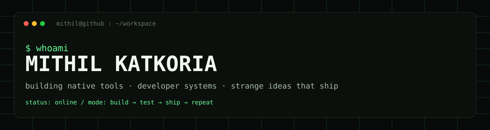

<div align="center">



<br />

<a href="https://draey.dev"></a>
<a href="https://www.linkedin.com/in/mithil-katkoria"></a>
<a href="https://medium.com/@mithil.katkoria"></a>
<a href="https://github.com/mithilkatkoria/floatlet"></a>
<a href="https://github.com/mithilkatkoria/draey-codex-hub"></a>

<br /><br />


</div>

## `/about`

I am **Mithil Katkoria**, a student developer in London building desktop software, developer tools, simulations and web products.

I like projects that sit close to the machine or solve an annoying problem properly. That currently means native Windows UI, C++, Rust/Tauri, Python simulation systems, developer tooling and the occasional hardware or computing experiment.

```txt
focus       native desktop software / developer tools / simulation
shipping    Windows apps, web products, experiments
learning    systems design, algorithms, performance, better engineering
rule        if it can be built cleaner, faster or stranger, try it
```

## `/active-processes`

<table>
<tr>
<td width="50%" valign="top">

### [Floatlet](https://github.com/mithilkatkoria/floatlet)
**Native Windows companion**

A compact Dynamic Island-style surface for Windows 11 with media controls, a file tray, timers, calendar integration, system controls and multi-monitor behaviour.

`C++20` `Direct2D` `DirectWrite` `Windows Composition`

</td>
<td width="50%" valign="top">

### [Draey Codex Hub](https://github.com/mithilkatkoria/draey-codex-hub)
**Multi-account Codex manager**

A Windows desktop dashboard for viewing real Codex usage limits, reset windows, projects and account preferences from one place.

`Tauri` `Rust` `TypeScript` `React`

</td>
</tr>
<tr>
<td width="50%" valign="top">

### [PITWALL](https://github.com/mithilkatkoria/PITWALL)
**Race strategy simulation system**

A motorsport strategy simulator with tyre degradation, weather, safety cars, Monte Carlo experiments and bounded strategy optimisation.

`Python` `PySide6` `Matplotlib` `pytest`

</td>
<td width="50%" valign="top">

### [Astro Pi Mission Zero](https://github.com/mithilkatkoria/astropi-mission-zero)
**ISS computing experiment**

Python experiment code using Sense HAT motion data, camera captures and time-based sensor processing, with real output preserved in the repository.

`Python` `Raspberry Pi` `Sense HAT` `Pi Camera`

</td>
</tr>
</table>

## `/stack`

```txt
languages    C++ · Python · TypeScript · JavaScript · HTML/CSS · Rust
desktop      Win32 · Direct2D · DirectWrite · Tauri · PySide6
web          React · Vercel · REST APIs
tooling      Git · GitHub Actions · CMake · pytest
interests    native UI · algorithms · developer experience · AI tooling · simulation
```

## `/build-log`

Some smaller experiments and workshop projects live here too:

- **[Inspire Scholars Workshop 4: Quantum Computing](https://github.com/mithilkatkoria/SuperChallenge---Upcoming-technologies-Workshop-4-2026)**: an interactive research poster exploring qubits, superposition, entanglement, interference and real-world quantum-computing applications.
- **[draey.dev](https://draey.dev)**: home base for the things I build.
- **[GitHub repositories](https://github.com/mithilkatkoria?tab=repositories)**: the rest of the lab.

## `/signal`

> *“People say that you should not micro-optimize. But if what you love is micro-optimization... that's what you should do.”*  
> **Linus Torvalds**

> *“Sometimes my genius is almost frightening.”*  
> **Jeremy Clarkson**

```text
mithil@github:~$ ./next
> build something useful
> understand how it works
> make the interface feel intentional
> ship it
█
```

<sub>
Search terms: Mithil Katkoria · Windows developer · C++ developer · Python developer · Tauri · Rust · developer tools · native Windows apps · simulation software
</sub>
